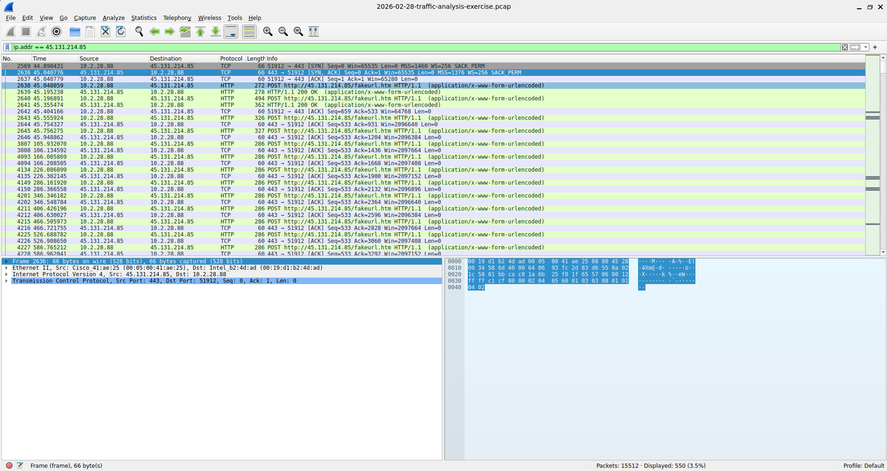
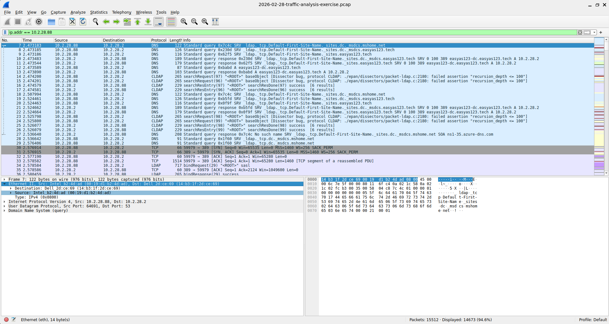
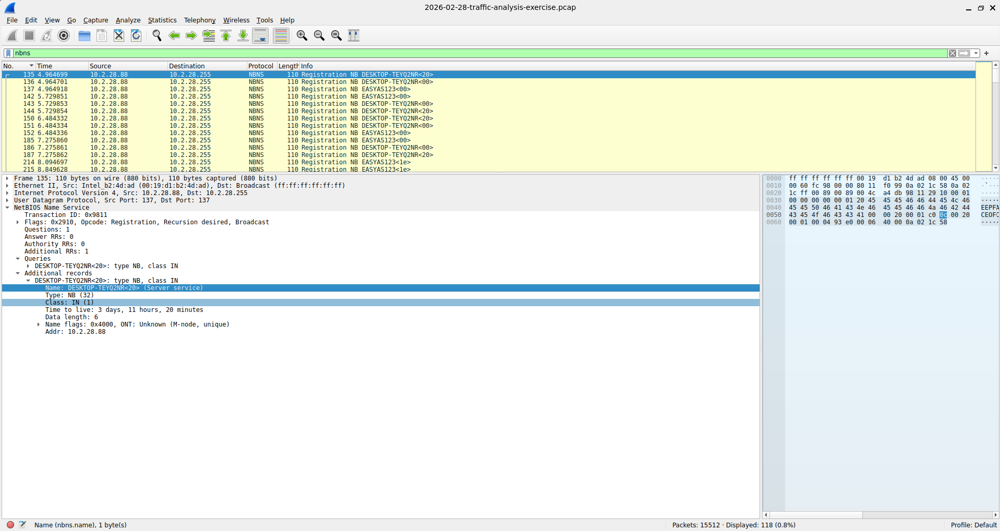
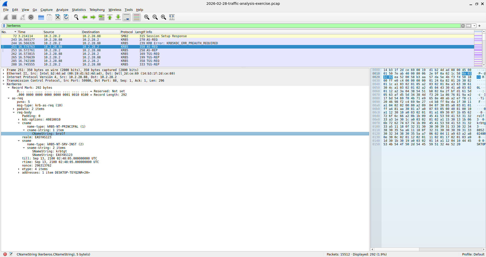
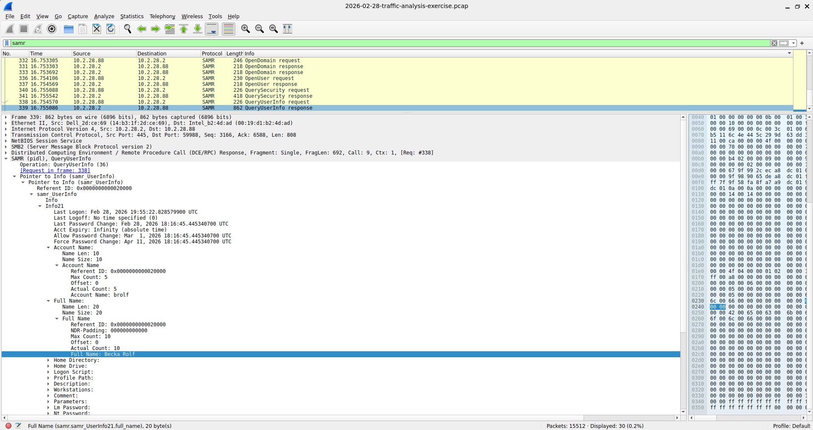

# Traffic Analysis Exercise: Easy As 123
**Fuente:** [malware-traffic-analysis.net - 2026-02-28](https://www.malware-traffic-analysis.net/2026/02/28/index.html)
**Herramienta:** Wireshark
**Fecha de análisis:** [poné la fecha en la que lo hiciste]
## Escenario
Como analista SOC, se detectaron múltiples alertas en el SIEM por firmas de **NetSupport Manager RAT**
desde la IP `45.131.214.85` sobre el puerto TCP 443. La actividad comenzó el 28 de febrero de 2026 a
las 19:55 UTC. El objetivo es analizar el pcap del tráfico interno que disparó esas alertas y armar
un reporte de incidente que permita rastrear la máquina infectada.
**Entorno:**
| | |
|---|---|
| Rango LAN | `10.2.28.0/24` |
| Dominio | `easyas123.tech` |
| Entorno AD | `EASYAS123` |
| Domain Controller | `10.2.28.2` — `EASYAS123-DC` |
| Gateway | `10.2.28.1` |
| Broadcast | `10.2.28.255` |
## Metodología
1. Filtré el tráfico por la IP maliciosa reportada en la alerta (`ip.addr == 45.131.214.85`) para
   identificar qué host interno se estaba comunicando con ella.
2. Una vez identificada la IP interna, extraje su dirección MAC directamente del frame Ethernet.
3. Para el hostname, probé en orden: DHCP (sin resultado), NBNS (encontrado).
4. Para el usuario, filtré tráfico Kerberos y busqué el `CNameString` en un paquete `AS-REQ`.
5. Para el nombre completo del usuario, filtré tráfico SAMR y encontré el campo `Full Name`
   en una respuesta `QueryUserInfo`.
## Hallazgos
| Dato | Valor | Protocolo/Fuente |
|---|---|---|
| IP del cliente infectado | `10.2.28.88` | Filtro por IP maliciosa |
| MAC address | `00:19:d1:b2:4d:ad` | Ethernet frame |
| Hostname | `DESKTOP-TEYQ2NR` | NBNS |
| Usuario | `brolf` | Kerberos (AS-REQ, CNameString) |
| Nombre completo del usuario | `Becka Rolf` | SAMR (QueryUserInfo, Full Name) |
### 1. Identificación de la comunicación con la IP maliciosa
Filtrando `ip.addr == 45.131.214.85` se confirmó que `10.2.28.88` es el host que se comunica
con la IP reportada en la alerta, consistente con tráfico de NetSupport RAT sobre TCP 443.

### 2. Dirección MAC
En el frame Ethernet con IP origen `10.2.28.88` se identificó la MAC del adaptador de red.

### 3. Hostname
DHCP no devolvió el hostname en este caso. Se encontró en tráfico NBNS, donde el host
se registra a sí mismo en la red por su nombre NetBIOS.

### 4. Usuario
En el paquete Kerberos `AS-REQ` (solicitud de autenticación contra el Domain Controller),
el campo `CNameString` reveló el username de la cuenta.

### 5. Nombre completo del usuario
El protocolo SAMR (usado para consultar cuentas en el dominio) expuso el `Full Name`
asociado a la cuenta en una respuesta `QueryUserInfo`.

## Conclusión
El host `DESKTOP-TEYQ2NR` (IP `10.2.28.88`, MAC `00:19:d1:b2:4d:ad`), utilizado por la cuenta
`brolf` (Becka Rolf), se comunicó con la IP `45.131.214.85` sobre TCP 443, consistente con
las alertas de NetSupport Manager RAT del SIEM. Se recomienda aislar el equipo, revisar
persistencia del RAT y resetear las credenciales del usuario afectado.
## Qué aprendí
- A identificar un host infectado a partir de una IP/IOC reportada en una alerta, sin depender
  de una sola fuente: cuando DHCP no tenía el hostname, pude encontrarlo por NBNS.
- Diferencia entre protocolos de identificación (NBNS/DHCP), autenticación (Kerberos) y
  consulta de directorio (SAMR/LDAP) dentro de un entorno Active Directory.
- A pensar en orden lógico "qué protocolo tendría este dato" en vez de probar todo al azar.
