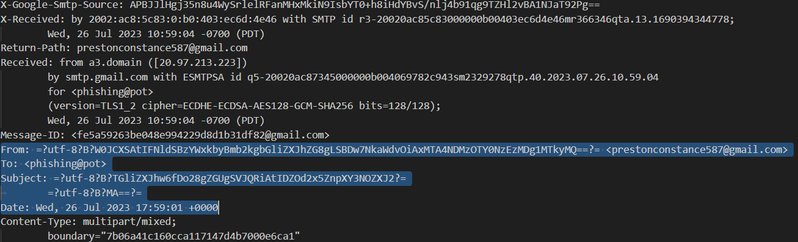
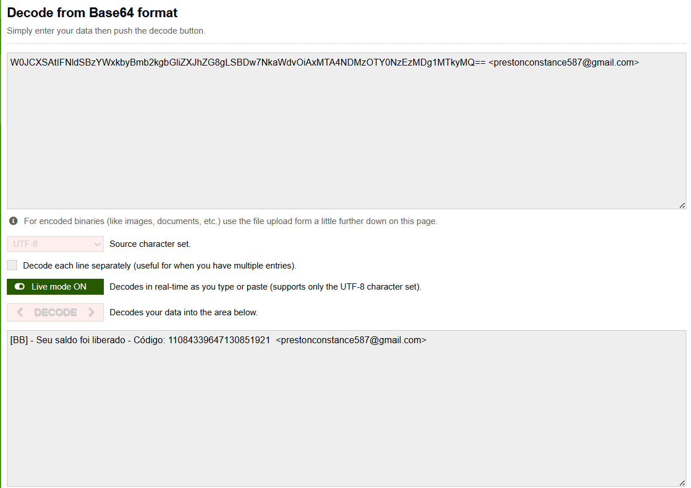
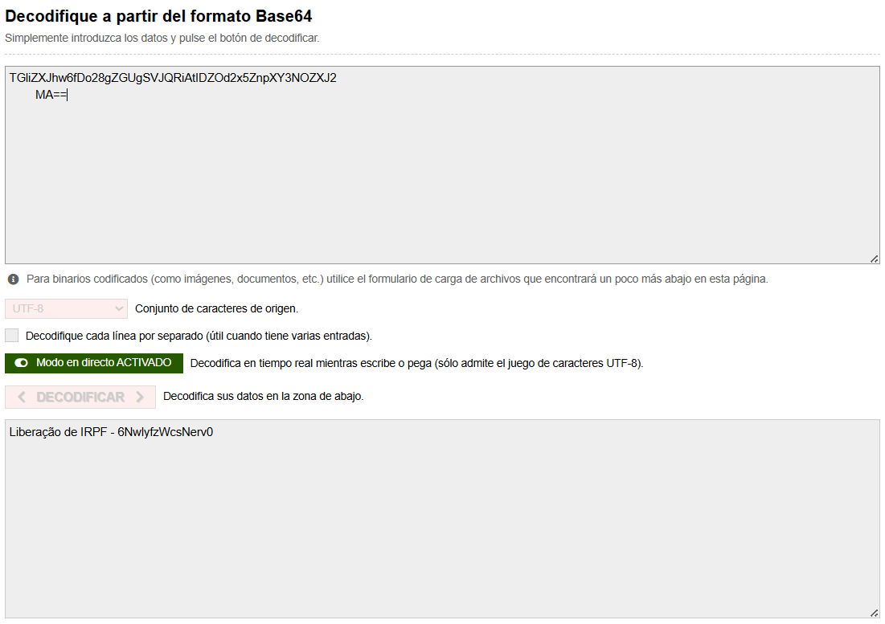
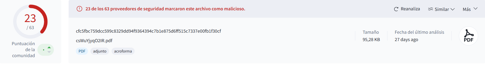
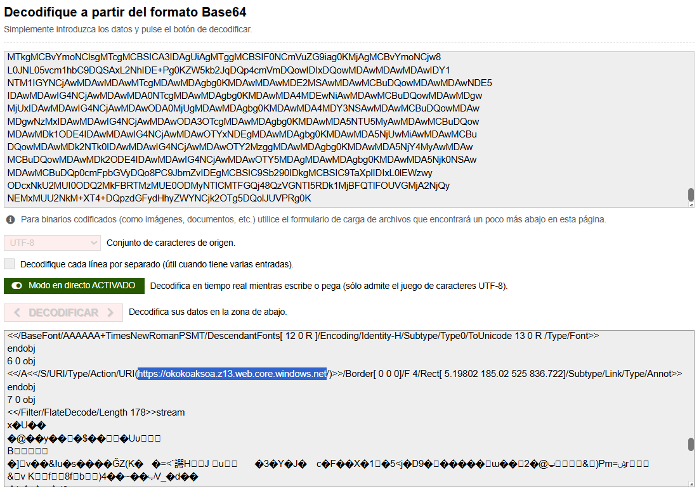
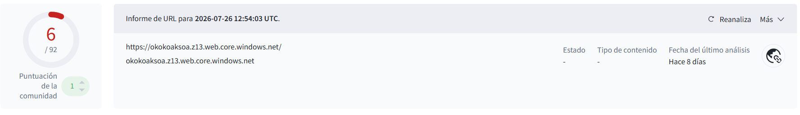

# Análisis de Phishing: "Liberação de IRPF"

**Fuente de la muestra:** [rf-peixoto/phishing_pot](https://github.com/rf-peixoto/phishing_pot/blob/main/email/sample-1000.eml) — `sample-1000.eml`
**Fecha del análisis:** 03/08/2026
**Tipo de campaña:** Phishing por correo electrónico con adjunto PDF malicioso

---

## Resumen ejecutivo

Se analizó una muestra de phishing extraída del repositorio público `phishing_pot`, correspondiente a una campaña dirigida a víctimas de habla portuguesa (Brasil), que suplanta una notificación de liberación de saldo relacionada al **IRPF** (*Imposto de Renda de Pessoa Física*, equivalente al Impuesto sobre la Renta de las Personas Físicas). El correo utiliza técnicas de ingeniería social basadas en urgencia económica y adjunta un PDF que contiene un enlace embebido hacia infraestructura de Azure Blob Storage abusada. El análisis dinámico en sandbox confirma comportamiento consistente con robo de credenciales, evasión de defensas e inyección de procesos.

---

## Metadatos del correo

| Campo | Valor |
|---|---|
| Asunto (decodificado) | `Liberação de IRPF - 6NwlyfzWcsNerv0` |
| Remitente | `prestonconstance587@gmail.com` |
| Destinatario | `phishing@pot` |
| Fecha de envío | Wed, 26 Jul 2023 17:59:01 +0000 |
| IP de origen | `20.97.213.223` (rango Microsoft Azure) |
| Adjunto | `csWuYjyqO2IR.pdf` |

**IRPF** son las siglas en portugués para *Imposto de Renda de Pessoa Física*. El correo informa a la víctima que tiene un "saldo liberado" junto con un código de referencia falso, generando una sensación de oportunidad y urgencia económica para inducir al clic en el enlace o a la apertura del adjunto.

---

## Decodificación del remitente (display name)

El nombre visible del remitente no era legible a simple vista — estaba codificado en Base64 dentro de la cabecera `From`:

```
From: =?utf-8?B?W0JCXSAtIFNldSBzYWxkbyBmb2kgbGliZXJhZG8gLSBDw7NkaWdvOiAxMTA4NDMzOTY0NzEzMDg1MTkyMQ==?= <prestonconstance587@gmail.com>
```



Al decodificar el Base64:

```
[BB] - Seu saldo foi liberado - Código: 11084339647130851921  <prestonconstance587@gmail.com>
```



**Observación:** tomando como referencia la dirección de correo (`prestonconstance587`), el nombre "esperable" sería algo como *"Preston Constance"*. En cambio, el atacante configuró un display name falso (`[BB] - Seu saldo foi liberado...`) para simular ser una notificación legítima de un banco brasileño (posiblemente Banco do Brasil, dado el prefijo `[BB]`), maximizando la credibilidad del engaño.

---

## Decodificación del asunto

El asunto también viaja codificado en `=?utf-8?B?...?=` (MIME encoded-word):

```
Subject: =?utf-8?B?TGliZXJhw6fDo28gZGUgSVJQRiAtIDZOd2x5ZnpXY3NOZXJ2?=
	=?utf-8?B?MA==?=
```



Resultado decodificado:

```
Liberação de IRPF - 6NwlyfzWcsNerv0
```

El sufijo alfanumérico (`6NwlyfzWcsNerv0`) es consistente con un identificador único de campaña, probablemente usado por el atacante para trackear aperturas o variantes de la plantilla de phishing.

---

## Análisis de autenticación del correo (SPF / DKIM / DMARC)

```
Authentication-Results: spf=pass (sender IP is 209.85.160.178) smtp.mailfrom=gmail.com;
 dkim=pass (signature was verified) header.d=gmail.com;
 dmarc=pass action=none header.from=gmail.com; compauth=pass reason=100
```

**Todos los mecanismos de autenticación pasan (PASS).** Esto es un punto clave: **no hubo spoofing técnico del dominio**. El atacante utilizó una cuenta real y autenticada de Gmail para el envío, por lo que el correo pasa legítimamente los controles SPF/DKIM/DMARC de Google. El engaño no está en la infraestructura de envío, sino enteramente en la ingeniería social del display name y el asunto.

**IP de origen real (antes del relay de Gmail):**

```
Received: from a3.domain ([20.97.213.223])
        by smtp.gmail.com with ESMTPSA id ...
```

La IP `20.97.213.223` pertenece al rango de **Microsoft Azure**, lo que sugiere que el atacante se autenticó contra el SMTP de Gmail desde una instancia/VM alojada en la nube de Azure — consistente con infraestructura automatizada de envío masivo de phishing, y no con un envío manual desde un dispositivo personal comprometido.

---

## Análisis del adjunto PDF

### Identificación del artefacto

| Campo | Valor |
|---|---|
| Nombre de archivo | `csWuYjyqO2IR.pdf` |
| Tamaño | 95.28 KB |
| Hash SHA-256 | `cfc5fbc759dcc599c8329dd94f9364394c7b1e875d6ff515c7337e00fb1f30cf` |

El adjunto fue extraído directamente del cuerpo MIME del `.eml` (venía embebido en Base64 dentro del multipart) y se calculó su hash SHA-256 para su verificación en VirusTotal.

### Verificación en VirusTotal (archivo)



**23 / 63** motores de seguridad marcan el archivo como malicioso. Detecciones representativas:

| Motor | Detección |
|---|---|
| Microsoft | `Trojan:PDF/Phish!atmn` |
| ESET-NOD32 | `Trojan PDF/Phishing.A.Gen` |
| Avast/AVG | `PDF:MalwareX-gen [Phishing]` |
| Varist | `PDF/ABFisher.OSQM` |
| Tencent | `Pdf.Trojano.Pdf.Ocnw` |

La etiqueta de amenaza consolidada por la comunidad es **`trojan.abphisher/atmn`**, una familia de detección genérica para PDFs que embeben enlaces de phishing.


### Extracción manual del objeto malicioso (análisis estático)

Se decodificó manualmente el stream Base64 del PDF para inspeccionar su estructura interna de objetos, encontrando el siguiente objeto de anotación:



```
6 0 obj
<</A<</S/URI/Type/Action/URI(https://okokoaksoa.z13.web.core.windows.net/)>>/Border[0 0 0]/F 4/Rect[5.19802 185.02 525 836.722]/Subtype/Link/Type/Annot>>
endobj
```

**Hallazgo clave:** el PDF tiene un link escondido que ocupa toda la página. No hace falta tocar un botón específico — con hacer clic en cualquier parte del documento, la víctima es redirigida a la URL maliciosa.

```
hxxps://okokoaksoa[.]z13.web.core.windows.net/
```

Este dominio corresponde a **Azure Static Website / Blob Storage**, un servicio legítimo de Microsoft abusado por el atacante porque:
1. Cuenta con certificado TLS válido emitido por Microsoft, lo que inspira confianza en la víctima.
2. Suele evadir filtros de reputación basados en dominio, al no estar en listas negras tan rápido como un dominio recién registrado.
3. Es desechable y trivial de recrear si es dado de baja.

### Verificación en VirusTotal (URL de destino)



**6 / 92** motores marcan la URL `okokoaksoa.z13.web.core.windows.net` como maliciosa, con último análisis reportado 8 días antes de esta revisión. Esto constituye una **segunda fuente de verificación independiente**, confirmando no solo que el archivo adjunto es malicioso, sino que la infraestructura de destino del enlace también está catalogada como tal.

### Análisis dinámico (sandbox)

Se ejecutó el archivo en múltiples entornos de sandbox (CAPE, VT Jujubox, Zenbox) a través de la plataforma de VirusTotal. El comportamiento reportado es consistente con una cadena de ataque más amplia que el simple enlace de phishing:

- Explotación del lector de PDF al momento de apertura
- Inyección de procesos (evasión de defensa / escalada de privilegios)
- Actividad de volcado de credenciales del sistema operativo
- Comunicación cifrada saliente hacia direcciones IP externas

---

## Indicadores de Compromiso (IOCs)

| Tipo | Valor |
|---|---|
| Correo remitente | `prestonconstance587@gmail.com` |
| IP de origen (SMTP autenticado) | `20.97.213.223` |
| Archivo adjunto | `csWuYjyqO2IR.pdf` |
| SHA-256 (PDF) | `cfc5fbc759dcc599c8329dd94f9364394c7b1e875d6ff515c7337e00fb1f30cf` |
| URL embebida | `hxxps://okokoaksoa.z13.web.core.windows.net/` |
| Código de campaña (asunto) | `6NwlyfzWcsNerv0` |
| Código de referencia falso  | `11084339647130851921` |

---

## Mapeo MITRE ATT&CK

| # | Técnica | Nombre | Táctica | Confianza | Fuente |
|---|---|---|---|---|---|
| 1 | T1566.001 | Spearphishing con archivo adjunto | Acceso inicial | **Alta** | Análisis manual (headers del `.eml`) |
| 2 | T1204.001 | Ejecución por parte del usuario: enlace malicioso | Ejecución | **Alta** | Análisis manual (objeto `/Annot` del PDF) |
| 3 | T1203 | Explotación para ejecución en el cliente | Ejecución | Media | Sandbox dinámico (CAPE / Zenbox) |
| 4 | T1055 | Inyección de procesos | Evasión de defensas / Escalada de privilegios | Media | Sandbox dinámico (CAPE / Zenbox) |
| 5 | T1003 | Volcado de credenciales del sistema operativo | Acceso a credenciales | Media | Sandbox dinámico (CAPE / Zenbox) |
| 6 | T1071 | Protocolo de la capa de aplicación | Comando y control | Media | Sandbox dinámico (CAPE / Zenbox) |

Las técnicas 1 y 2 se confirmaron a mano, leyendo los headers del correo y decodificando la estructura interna del PDF — no dependen de ninguna herramienta externa. Las técnicas 3 a 6 provienen de la ejecución del archivo en sandboxes (CAPE y Zenbox), accedidos a través de la pestaña "Comportamiento" de VirusTotal: VirusTotal no las detecta por sí mismo, solo agrega y muestra lo que estos motores de análisis dinámico reportaron al detonar el archivo.

---

## Conclusión

La muestra analizada corresponde a una campaña de phishing dirigida, automatizada y de bajo costo operativo para el atacante: aprovecha una cuenta real de Gmail (evitando problemas de autenticación SPF/DKIM/DMARC) y aloja su infraestructura de redirección en un servicio cloud legítimo (Azure Blob Storage), dificultando su detección temprana por reputación de dominio.

## Qué aprendí

- Cómo se usa Base64 y cómo "limpiarlo" para que decodifique bien
- Qué significan SPF, DKIM y DMARC, y que un correo puede pasar los tres perfecto y aun así ser phishing
- Cómo extraer un adjunto que viene embebido en Base64 dentro de un `.eml`
- A mirar la estructura interna de un PDF para encontrar un link escondido, en vez de confiar solo en el antivirus
- La diferencia entre análisis estático (mirar el archivo quieto) y análisis dinámico (verlo correr en un sandbox), y que ninguno de los dos alcanza solo
- Que hay que fijarse bien de dónde sale cada dato — VirusTotal no "descubre" comportamiento, solo muestra lo que reportan los sandboxes

## Referencias

- Muestra original: [rf-peixoto/phishing_pot](https://github.com/rf-peixoto/phishing_pot/blob/main/email/sample-1000.eml)
- [VirusTotal — análisis del hash del PDF](https://www.virustotal.com/gui/file/cfc5fbc759dcc599c8329dd94f9364394c7b1e875d6ff515c7337e00fb1f30cf)
- [MITRE ATT&CK](https://attack.mitre.org/)
